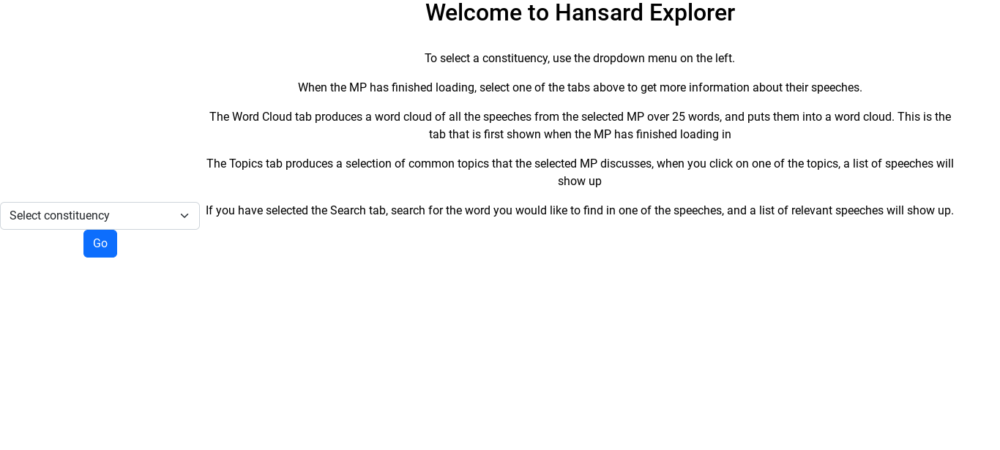
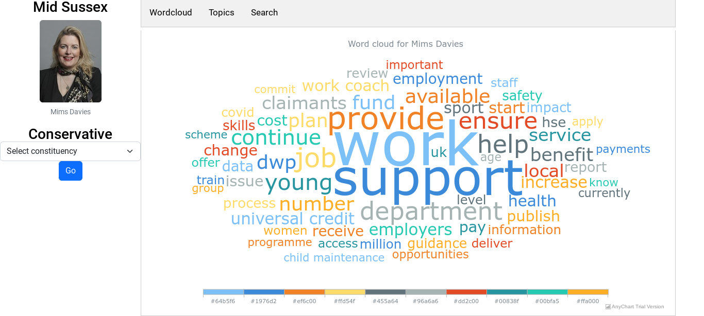
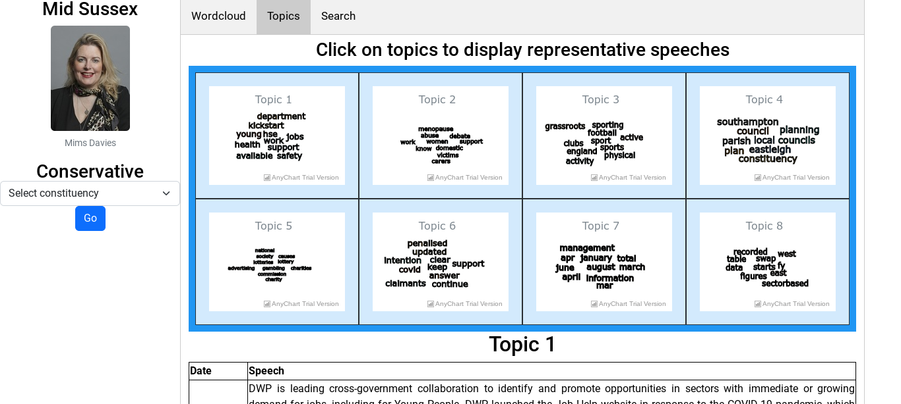
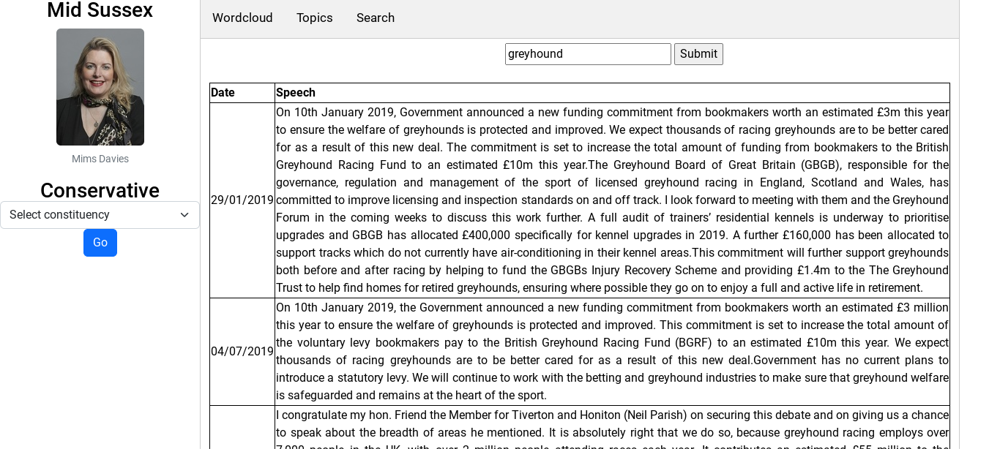

# Hansard Explorer
## This is the A-level computing project for Freddie Stather

This project is currently hosted at http://3.10.107.222:8080/

## How to install the programme

### Configure Python virtual environment

Creating a virtual environment called venv
```bash
python3 -m venv venv
. venv/bin/activate
python -m pip install -r requirements.txt
```
To run the Flask server in debug mode on port 8080:
```bash
python run.py --debug --port 8080
```
To run the Flask server in production mode on port 8080:
```bash
python run.py --port 8080
```
To run using [gunicorn](https://gunicorn.org/):
```bash
gunicorn -w 2 -b 0.0.0.0:8080 --timeout 600 'run:create_app()'
```


## Screenshots of use


The first page you see when the website initially loads. Shows the user how to use the website and how it all works.





When the user searches for a constituency using the dropdown search box, this page loads up with a wordcloud of all of their speeches. The user then has the option of looking through the other tabs at the top of the screen





Another tab the user can look through. This tab has a list of common topics the chosen MP discusses, and the user can click on one of the topic to see speeches that relate to it.





The final tab the user can look through. This tab allows the user to search through speeches containing a certain word or phrase, and will return relevant speeches.





